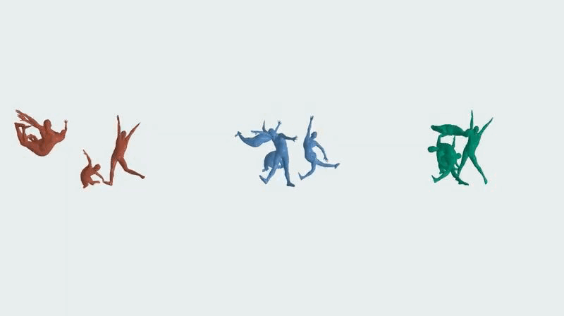

## HAMPL - *汉子 (Hànzi) to SMPL*


Turn Hànzì into SMPL poses as demonstrated above for 火，水，木. The pipeline is based on an optimization scheme with PyTorch with some random initialization, so the final poses vary based on the seed.

This is a non-commerical artistic project.

### Installation
1. Download the SMPL model from [here](https://smpl.is.tue.mpg.de/).
2. Get the *graphics.txt* from [makemeahanzi](https://github.com/skishore/makemeahanzi).
3. Install dependencies:
   1. ```conda create -n hampl python=3.10```
   2. ```conda activate hampl```
   3. ```conda install -c anaconda cairo```
   4. ```pip install -r requirements.txt```

### Usage
```python hampl.py -c 火 --device 'cuda' --smpl_path <PATH_TO_SMPL.pkl> --graphics_path <PATH_TO_graphics.txt> ```

To save the meshes without rendering, omit ```--no_render``` and use ```--save_mesh```. For arguments and details, check the top of the ```hampl.py```. Especially, if you want to change the colors and length of the video sequence.

Note that it is pretty slow to render on CPU because I am using PyTorch3D to do so.

Have fun 😊.
